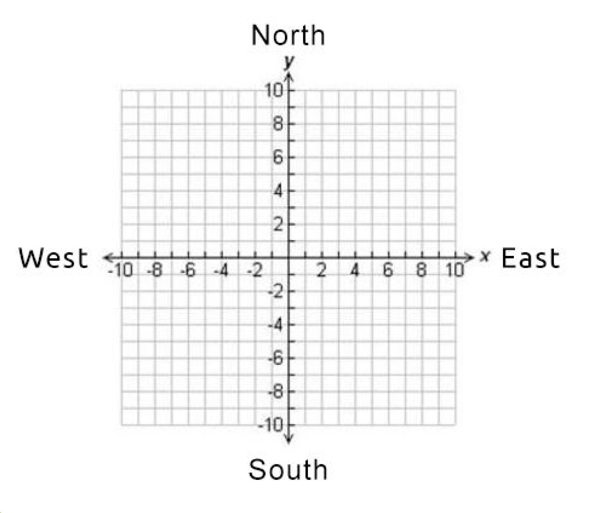

# Mars Rover Positioner

Model a rover moving on Mars via multiple commands.

## Problem

You are part of the team that explores Mars by sending remotely controlled vehicles to the surface of
the planet.

When the rover touches down on Mars, it is initialised with its current coordinates and the direction
it is facing. These could be any coordinates, supplied as arguments `(x, y, direction)` e.g. `(4,
2, EAST)` .



The rover is given a command string which contains multiple commands. 
This string must then be broken into each individual command and that command then executed.
```
F -> Move forward on current heading
B -> Move backwards on current heading
L -> Rotate left by 90 degrees
R -> Rotate right by 90 degrees
```
An example command might be `FLFFFRFLB`.

Once the full command string has been followed, the rover reports its current coordinates and
heading in the format `(6, 4) NORTH`

## Solution

Import the ```Rover``` instance to be used in your projects.

Sample code in NodeJS interpreter (if needed start with `node --experimental-loader=module`)

```js
const { Rover } = await import("./src/index.js");
const rover = new Rover();
rover.init(0, 0, "NORTH");
rover.execute("FFF");
console.log(`${rover}`); // (0, 3) NORTH
```

Some constants are exported for convenience:
```js
const { Rover, Direction, MoveCommand } = await import("./src/index.js");
const rover = new Rover();
rover.init(0, 0, Direction.North);
rover.execute([
  MoveCommand.Forward,
  MoveCommand.Forward,
  MoveCommand.Forward
].join());
console.log(`${rover}`);
```

Other convenience methods:

```js
rover.setState({x: 0, y: 0, direction: "NORTH"})
rover.getState()
rover.toString() // making sure it prints nice when used in `${}` strings
```

## Developer Instructions 

### Installation 

NodeJS:

1. Install `nvm` for managing different NodeJS versions
2. `nvm use` to install the correct NodeJS version

Dependencies
```bash
npm ci
``` 

### Tests

The solution was developed using TDD.
First idea was to tackle the moving algorithm in a stateless manner
and then wrap everything in a stateful container.

Main specs to be inspected:

1. [`positioner.spec.js`](./test/positioner.spec.js) --- main algorithm
2. [`rover.spec.js`](./test/rover.spec.js) --- wrapper class

```bash
npm test
```

## Server

We prepared a server to listen on `http://localhost:5000/api` to test out the solution.

Start it:
```bash
npm start
```

Interact with it:
```bash
curl -X POST http://localhost:5000/api -H 'Content-Type: application/json' -d '{"state": {"x": 0, "y": 0, "direction": "NORTH"}, "command": "FFF"}'
```
